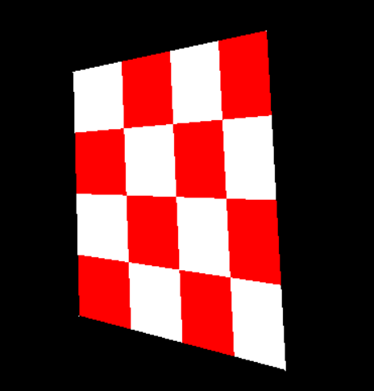
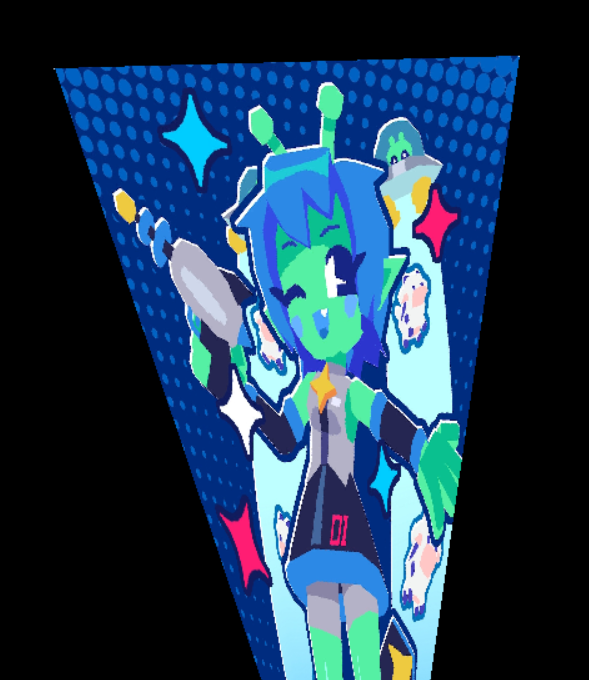

# love.Perspective

A simple module to draw images with perspective transformations, using meshes only.  Love2D (LÖVE2D)

I noticed that Meshes are probably the least well explained part of Love2D for people new to it.  And, one of the most common things people try to do when they start trying to learn Meshes is how to distort images in a perspective transformation - and then walk away even more confused as they get halfway there.

So, the way this works is that it takes an image, chops it up into a bunch of triangles, and then approximates a true perspective transformation with some linear interpolation.

Usage is easy as pie.

```lua
M = require "Perspective"

image = love.graphics.newImage("uv.png")
tl = {x=0, y=50}
tr={x=200, y=0}
bl={x=0, y=300}
br={x=200, y=350}
local vertices = {tl=tl,tr=tr,bl=bl,br=br}
myMesh = M.getWarpedImage(image, vertices,16)

love.graphics.draw(myMesh,100,100)
```

You decide just how much you want to chop it up on each axis (16 is the default)

See examples:




